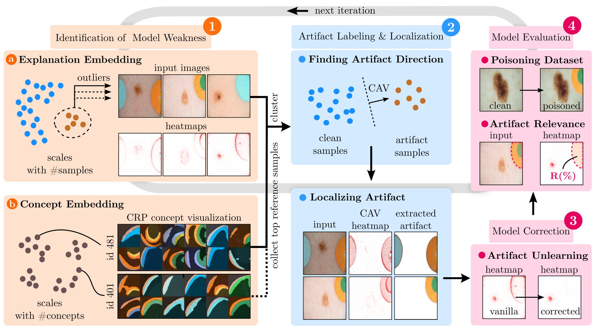
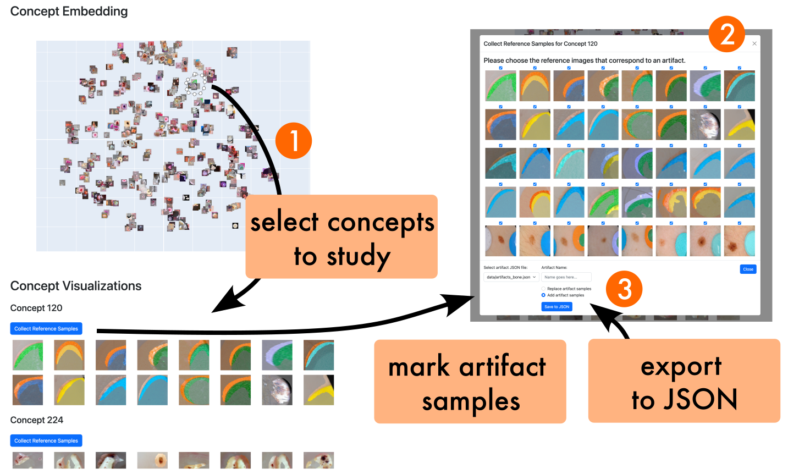
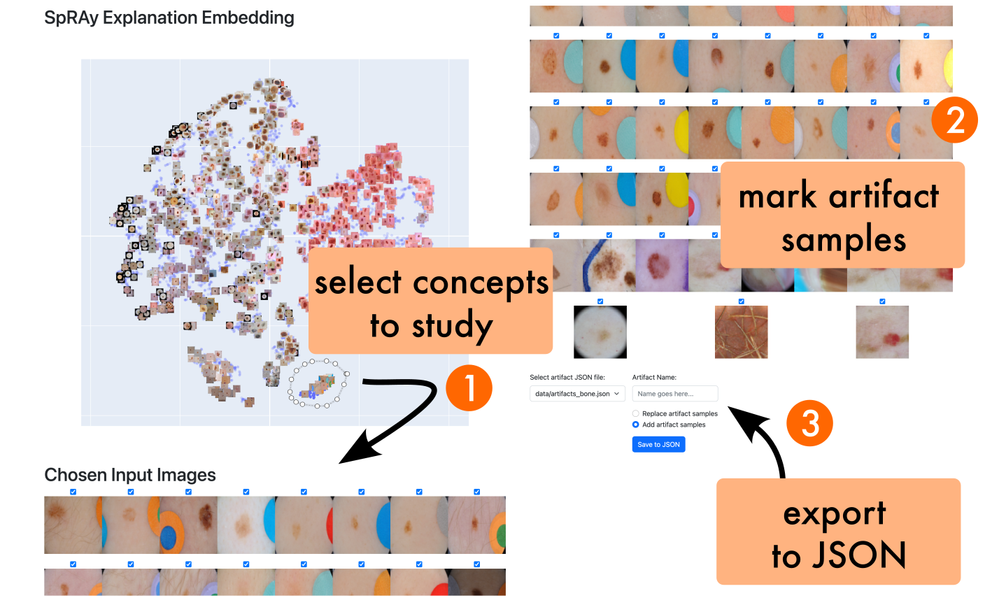

<div align="center">

<h1>Reveal to Revise: An Explainable AI Life Cycle for Iterative Bias Correction of Deep Models</h1>
<p>
PyTorch</p>
</div>

[](https://arxiv.org/abs/2303.12641)

[//]: # ([![pytorch]&#40;https://img.shields.io/badge/pytorch-1.8.1-ee4c2c.svg&#41;]&#40;https://pytorch.org/&#41;)

[//]: # ([![python]&#40;https://img.shields.io/badge/python-3.8.10-3776ab.svg&#41;]&#40;https://www.python.org/&#41;)

## Description

State-of-the-art machine learning models often learn spurious correlations embedded in the training data.
This poses risks when deploying these models for high-stake decision-making,
such as in medical applications like skin cancer detection.

To tackle this problem, we propose Reveal to Revise (R2R),
a framework entailing the entire eXplainable Artificial Intelligence (XAI) life cycle,
enabling practitioners to iteratively identify, mitigate,
and (re-)evaluate spurious model behavior with a minimal amount of human interaction.

<div align="center">

<p>
Overview of the Reveal to Revise method.</p>

</div>

In the first step (1),
R2R reveals model weaknesses by finding outliers in attributions or through inspection of latent concepts learned by the
model.
Secondly (2), the responsible artifacts are detected and spatially localized in the input data,
which is then leveraged to (3) revise the model behavior.
Concretely, we apply the methods of RRR, CDEP and ClArC for model correction,
and (4) (re-)evaluate the model’s performance and remaining sensitivity towards the artifact.

Using two medical benchmark datasets for Melanoma detection and bone age estimation,
we apply our R2R framework to VGG,
ResNet and EfficientNet architectures and thereby reveal and correct real dataset-intrinsic artifacts,
as well as synthetic variants in a controlled setting.

Please feel free to cite our work, if used in your research:

```bibtex
@article{pahde2023reveal,
  title={Reveal to Revise: An Explainable AI Life Cycle for Iterative Bias Correction of Deep Models},
  author={Pahde, Frederik and Dreyer, Maximilian and Samek, Wojciech and Lapuschkin, Sebastian},
  journal={arXiv preprint arXiv:2303.12641},
  year={2023}
}
```

## Table of Contents

- [Reveal to Revise: An Explainable AI Life Cycle for Iterative Bias Correction of Deep Models](#reveal-to-revise-an-explainable-ai-life-cycle-for-iterative-bias-correction-of-deep-models)
    - [Description](#description)
    - [Table of Contents](#table-of-contents)
    - [Installation](#installation)
    - [Model Training](#model-training)
    - [Revealing Spurious Behavior](#revealing-spurious-behavior)
    - [Model Correction](#model-correction)
    - [Model Evaluation](#model-evaluation)

[//]: # (## Visuals)

## Installation

We use Python 3.8.10. To install the required packages, run:

```bash 
pip install -r requirements.txt
```

Secondly, the datasets need to be downloaded. To do so, download and extract the ISIC 2019 dataset using the following:

```bash
mkdir datasets
cd datasets
wget https://isic-challenge-data.s3.amazonaws.com/2019/ISIC_2019_Training_Input.zip
wget https://isic-challenge-data.s3.amazonaws.com/2019/ISIC_2019_Training_GroundTruth.csv
unzip ISIC_2019_Training_Input.zip
```

Then, we need to download the Bone Age Estimation dataset. To do so, run:

```bash
wget https://s3.amazonaws.com/east1.public.rsna.org/AI/2017/Bone+Age+Training+Set.zip
wget https://s3.amazonaws.com/east1.public.rsna.org/AI/2017/Bone+Age+Training+Set+Annotations.zip
unzip Bone+Age+Training+Set.zip
unzip Bone+Age+Training+Set+Annotations.zip
cd ..
```

## Model Training (optional)

Having installed the required packages and datasets,
we can begin with training the models. To do so convieniently,
we use config files to specify the model, dataset and training parameters.

### Config Files

We can generate config files using the config file generator.
To do so,
specify the config file generator parameters in `config_files/config_generator_training.py` and run:

```bash 
cd config_files
python config_generator_training.py
cd ..
```

Note: We suggest to use wandb to track the training progress and results.

### Training

Using the previously generated config files, we can train the models.
To do so, run:

```bash
python -m model_training.start_training --config_file "config_files/training/your_config_file.yaml"
```

**NOTE**: We provide model checkpoints! All checkpoints can be found in the download scripts in the `scripts` folder.
An example for the ISIC models can be found here:

```bash
echo "Download VGG"
wget https://datacloud.hhi.fraunhofer.de/s/Tq2fGgtEZ2mMFQ4/download/checkpoint_vgg16_isic_last.pth

echo "Download ResNet18"
wget https://datacloud.hhi.fraunhofer.de/s/pijw3KFNdcZNi2e/download/checkpoint_resnet18_isic_last.pth

echo "Download EfficientNet B0"
wget https://datacloud.hhi.fraunhofer.de/s/3WoL9Ge38jJ93xN/download/checkpoint_efficientnet_b0_isic_last.pth
```

## Revealing Spurious Behavior

To reveal spurious behavior, we propose the following steps:

Create new config files for the model correction experiments, which are also used for revealing model bias.
To do so,
specify the config file generator parameters in `config_files/config_generator_correcting_isic.py` and run:

```bash 
cd config_files
python config_generator_correcting_isic.py
cd ..
```

In the following,
you can choose between using CRP concept visualizations to find bias concepts, or SpRAy to find input samples with
outlier explanations.

### CRP

<div align="center">

<p>Interactive Tool based on the Dash package</p>
</div>

#### (1) Run CRP preprocessing:

```bash
python -m experiments.reveal_artifacts.crp_run --config_file "config_files/correction/your_config_file.yaml"
```

**QUICKSTART**: To get started with CRP right away, we provide the CRP analysis
file [here](https://datacloud.hhi.fraunhofer.de/s/RqBD3gG57FbYKbR/download/crp_vgg16_Vanilla.zip) for the VGG-16 model
trained on the ISIC dataset, which needs to be extracted in the `crp_files` directory.

#### (2) Plot the CRP concepts in layer `concept_layer` by running:

Note, that the `concept_layer` represents the name of the layer in which the CRP concepts are investigated,
e.g. `features.28` for
VGG-16.

```bash
python -m experiments.reveal_artifacts.crp_plot_concept_embedding_plotly  --config_file "config_files/correction/your_config_file.yaml" \
                                                                          --layer_name "concept_layer"
```

This will start an interactive plot based on [Dash](https://dash.plotly.com),
allowing you to investigate the learned concepts and find spurious ones.
Having found spurious concepts, you are able to export the corresponding reference samples in the tool.

**QUICKSTART**: Simply run `python -m experiments.reveal_artifacts.crp_plot_concept_embedding_plotly` to investigate the
concepts in layer `features.28` of the VGG-16 model trained on the ISIC dataset.

### SpRAy

<div align="center">

<p>Interactive Tool based on the Dash package</p>
</div>

#### (1) Run SpRAy preprocessing:

consisting of two steps: (1) collect relevances and activations, and (2) compute SpRAy embedding.

```bash
$config_path="config_files/correction/your_config_file.yaml"
$analyze_corrected_model=False

for class_id in {0,1,...}; do
  python3 -m experiments.preprocessing.global_collect_relevances_and_activations  --config_file $config_path \
                                                                                  --class_id $class_id \
                                                                                  --use_corrected_ckpt $analyze_corrected_model \
done

python -m experiments.reveal_artifacts.run_spray  --config_file $config_path \
                                                  --layer_name "concept_layer" \
                                                  --analysis-file "results/spray/analysis.hdf5" \
                                                  --corrected_model $analyze_corrected_model \
```

**QUICKSTART**: To get started with SpRAy right away, we provide the analysis
file [here](https://datacloud.hhi.fraunhofer.de/s/4rrQoGtosSYmmkZ/download/vgg16_Vanilla_features28.hdf5) for the VGG-16
model
trained on the ISIC dataset, which needs to be extracted in the `results/spray` directory.

#### (2) Show SpRAy embedding:

```bash
python -m experiments.reveal_artifacts.plot_spray_embedding_plotly --config_file "config_files/correction/your_config_file.yaml"
```

**QUICKSTART**: Simply run `python -m experiments.reveal_artifacts.plot_spray_embedding_plotly` to investigate the
VGG-16 model trained on the ISIC dataset.

Please note,
that we already provide the artifact sample ids for the ISIC and Bone Age datasets.

### Artifact Localization

Having found the artifact samples,
we can localize them in the input data by running:

```bash
python -m experiments.reveal_artifacts.localize_artifacts --config_file "config_files/correction/your_config_file.yaml"
```

This effectively saves the artifact heatmaps in the `data/localized_artifacts` folder.
Please note,
that we already provide the artifact heatmaps for the ISIC and Bone Age datasets.

## Model Correction

Now, we can correct the model bias by running:

```bash
python -m model_training.start_model_correction--config_file "config_files/correcting_isic/your_config_file.yaml"
```

## Model Evaluation

Finally, we can evaluate the corrected model by running:

```bash
python -m experiments.evaluation.artifact_relevance --config_file "config_files/correction/your_config_file.yaml"

for artifact in {band_aid,ruler,skin_marker}; do
  python -m experiments.evaluation.accuracy_attacked_auto --config_file "config_files/correction/your_config_file.yaml" --artifact $artifact
done

python -m experiments.evaluation.evaluate_by_subset --config_file "config_files/correction/your_config_file.yaml"
```

where this is an example for the ISIC data-intrinsic artifacts (band_aid,ruler,skin_marker).

